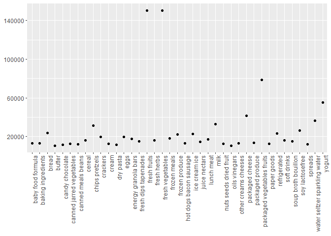

p8105\_hw3\_hz2770
================
Hao Zheng
2021/10/16

``` r
library(tidyverse)
```

    ## -- Attaching packages --------------------------------------- tidyverse 1.3.1 --

    ## v ggplot2 3.3.5     v purrr   0.3.4
    ## v tibble  3.1.4     v dplyr   1.0.7
    ## v tidyr   1.1.3     v stringr 1.4.0
    ## v readr   2.0.1     v forcats 0.5.1

    ## -- Conflicts ------------------------------------------ tidyverse_conflicts() --
    ## x dplyr::filter() masks stats::filter()
    ## x dplyr::lag()    masks stats::lag()

## Problem 1

First, load the “instacart” dataset.

``` r
library(p8105.datasets)
data("instacart")

# Create a dataframe for instacart
instacart_df = 
  instacart %>% 
  select(order_id, everything())
```

1.  Now, we want to see how many aisles are there in the dataset
    “instacart” and which aisle has the most orders.

``` r
sum_by_aisle = 
  instacart_df %>% 
  group_by(aisle) %>% 
  summarise(n_obs = n())

sum_by_aisle
```

    ## # A tibble: 134 x 2
    ##    aisle                  n_obs
    ##    <chr>                  <int>
    ##  1 air fresheners candles  1067
    ##  2 asian foods             7007
    ##  3 baby accessories         306
    ##  4 baby bath body care      328
    ##  5 baby food formula      13198
    ##  6 bakery desserts         1501
    ##  7 baking ingredients     13088
    ##  8 baking supplies decor   1094
    ##  9 beauty                   287
    ## 10 beers coolers           1839
    ## # ... with 124 more rows

``` r
sum_by_aisle %>% 
  filter(min_rank(desc(n_obs))< 2)
```

    ## # A tibble: 1 x 2
    ##   aisle             n_obs
    ##   <chr>             <int>
    ## 1 fresh vegetables 150609

There are 134 aisles in total, and the most items are ordered from the
aisle “fresh vegetables”, which is 1.50609^{5} in total.

2.  Then we try to show the number of items sold in each aisle with a
    number over 10000 via a scatter plot.

``` r
filter_sum_by_aisle = 
  sum_by_aisle %>% 
  filter(n_obs > 10000)

filter_sum_by_aisle
```

    ## # A tibble: 39 x 2
    ##    aisle                    n_obs
    ##    <chr>                    <int>
    ##  1 baby food formula        13198
    ##  2 baking ingredients       13088
    ##  3 bread                    23635
    ##  4 butter                   10575
    ##  5 candy chocolate          11453
    ##  6 canned jarred vegetables 12679
    ##  7 canned meals beans       11774
    ##  8 cereal                   16201
    ##  9 chips pretzels           31269
    ## 10 crackers                 19592
    ## # ... with 29 more rows

``` r
filter_sum_by_aisle %>%
  ggplot(aes(x = aisle, y = n_obs)) +
  geom_point() +
  labs(x = NULL, y = NULL) +
  scale_y_continuous(
    breaks = c(20000, 60000, 100000, 140000, 180000),
    labels = c("20000", "60000", "100000", "140000", "180000")
  ) +
  theme(axis.text.x = element_text(angle=90, hjust=1))
```

<!-- -->

Then we got that there are 39 aisles in total have more than 10000 items
sold, among which, “fresh fruits” and “fresh vegetables” have the most
sold.

3.  
