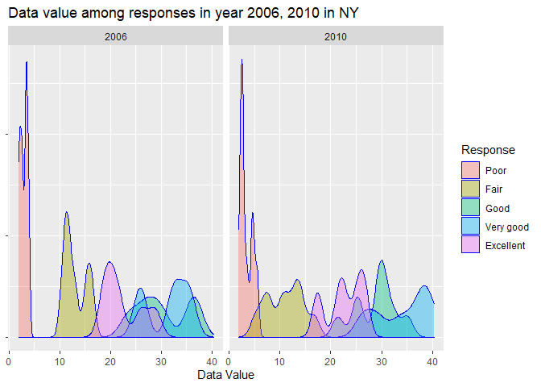

p8105\_hw3\_hz2770
================
Hao Zheng
2021/10/16

``` r
library(tidyverse)
```

    ## -- Attaching packages --------------------------------------- tidyverse 1.3.1 --

    ## v ggplot2 3.3.5     v purrr   0.3.4
    ## v tibble  3.1.4     v dplyr   1.0.7
    ## v tidyr   1.1.3     v stringr 1.4.0
    ## v readr   2.0.1     v forcats 0.5.1

    ## -- Conflicts ------------------------------------------ tidyverse_conflicts() --
    ## x dplyr::filter() masks stats::filter()
    ## x dplyr::lag()    masks stats::lag()

``` r
library(patchwork)
```

## Problem 1

First, load the “instacart” dataset.

``` r
library(p8105.datasets)
data("instacart")
```

Description of the dataset: The dataset “instacart” contains
`nrows = 1,384,617`, `ncols = 15`. There are 4 character variables:
eval\_set, product\_name, aisle and department. All the other variables
are integer variables.

1.  Now, we want to see how many aisles are there in the dataset
    “instacart” and which aisle has the most orders.

``` r
sum_by_aisle = 
  instacart %>% 
  group_by(aisle) %>% 
  summarise(n_obs = n())

sum_by_aisle
```

    ## # A tibble: 134 x 2
    ##    aisle                  n_obs
    ##    <chr>                  <int>
    ##  1 air fresheners candles  1067
    ##  2 asian foods             7007
    ##  3 baby accessories         306
    ##  4 baby bath body care      328
    ##  5 baby food formula      13198
    ##  6 bakery desserts         1501
    ##  7 baking ingredients     13088
    ##  8 baking supplies decor   1094
    ##  9 beauty                   287
    ## 10 beers coolers           1839
    ## # ... with 124 more rows

``` r
sum_by_aisle %>% 
  filter(min_rank(desc(n_obs))< 2)
```

    ## # A tibble: 1 x 2
    ##   aisle             n_obs
    ##   <chr>             <int>
    ## 1 fresh vegetables 150609

There are 134 aisles in total, and the most items are ordered from the
aisle “fresh vegetables”, which is 150609 in total.

2.  Then we try to show the number of items sold in each aisle with a
    number over 10000 via a scatter plot.

``` r
filter_sum_by_aisle = 
  sum_by_aisle %>% 
  filter(n_obs > 10000)

filter_sum_by_aisle
```

    ## # A tibble: 39 x 2
    ##    aisle                    n_obs
    ##    <chr>                    <int>
    ##  1 baby food formula        13198
    ##  2 baking ingredients       13088
    ##  3 bread                    23635
    ##  4 butter                   10575
    ##  5 candy chocolate          11453
    ##  6 canned jarred vegetables 12679
    ##  7 canned meals beans       11774
    ##  8 cereal                   16201
    ##  9 chips pretzels           31269
    ## 10 crackers                 19592
    ## # ... with 29 more rows

``` r
filter_sum_by_aisle %>%
  ggplot(aes(x = aisle, y = n_obs)) +
  geom_point() +
  labs(x = NULL, y = NULL) +
  scale_y_continuous(
    breaks = c(20000, 60000, 100000, 140000, 180000),
    labels = c("20000", "60000", "100000", "140000", "180000")
  ) +
  theme(axis.text.x = element_text(angle=90, hjust=1))
```

<!-- -->

Then we got that there are 39 aisles in total have more than 10000 items
sold, among which, “fresh fruits” and “fresh vegetables” have the most
sold.

3.  Create a table to show the top three items in aisle “baking
    ingredients”, “dog food care” and “packaged vegetables fruits”.

``` r
final_rank =
  instacart %>%
  filter(
    aisle %in% c("baking ingredients", "dog food care", "packaged vegetables fruits")
    ) %>% 
  group_by(aisle, product_name) %>% 
  summarise(num_ordered = n()) %>% 
  filter(min_rank(desc(num_ordered)) < 4) %>% 
  mutate(
    rank_in_aisle = min_rank(desc(num_ordered))
    ) %>% 
  arrange(aisle, rank_in_aisle) %>% 
  select(aisle, rank_in_aisle, product_name, num_ordered) %>% 
  knitr::kable()
```

    ## `summarise()` has grouped output by 'aisle'. You can override using the `.groups` argument.

``` r
final_rank
```

| aisle                      | rank\_in\_aisle | product\_name                                 | num\_ordered |
|:---------------------------|----------------:|:----------------------------------------------|-------------:|
| baking ingredients         |               1 | Light Brown Sugar                             |          499 |
| baking ingredients         |               2 | Pure Baking Soda                              |          387 |
| baking ingredients         |               3 | Cane Sugar                                    |          336 |
| dog food care              |               1 | Snack Sticks Chicken & Rice Recipe Dog Treats |           30 |
| dog food care              |               2 | Organix Chicken & Brown Rice Recipe           |           28 |
| dog food care              |               3 | Small Dog Biscuits                            |           26 |
| packaged vegetables fruits |               1 | Organic Baby Spinach                          |         9784 |
| packaged vegetables fruits |               2 | Organic Raspberries                           |         5546 |
| packaged vegetables fruits |               3 | Organic Blueberries                           |         4966 |

4.  Now, show the mean hour of the day at which Pink Lady Apples and
    Coffee Ice Cream are ordered on each day of the week.

``` r
apple_and_coffee = 
  instacart %>%
  mutate(day = order_dow +1) %>%
  mutate(day_of_week = lubridate::wday(day, label = TRUE, locale = "English_United States")) %>%
  filter(product_name %in% c("Pink Lady Apples", "Coffee Ice Cream")) %>% 
  group_by(product_name, day_of_week) %>%  
  summarise(
    mean_hour_of_day = mean(order_hour_of_day, na.rm = TRUE)
    ) %>% 
  pivot_wider(
    names_from = "day_of_week",
    values_from = "mean_hour_of_day"
    ) %>% 
  knitr::kable()
```

    ## `summarise()` has grouped output by 'product_name'. You can override using the `.groups` argument.

``` r
apple_and_coffee
```

| product\_name    |      Sun |      Mon |      Tue |      Wed |      Thu |      Fri |      Sat |
|:-----------------|---------:|---------:|---------:|---------:|---------:|---------:|---------:|
| Coffee Ice Cream | 13.77419 | 14.31579 | 15.38095 | 15.31818 | 15.21739 | 12.26316 | 13.83333 |
| Pink Lady Apples | 13.44118 | 11.36000 | 11.70213 | 14.25000 | 11.55172 | 12.78431 | 11.93750 |

## Problem 2

First, let us load the dataset brfss\_smart2010 from the P8105 datasets.

``` r
data("brfss_smart2010")

head(brfss_smart2010)
```

    ## # A tibble: 6 x 23
    ##    Year Locationabbr Locationdesc  Class  Topic  Question   Response Sample_Size
    ##   <int> <chr>        <chr>         <chr>  <chr>  <chr>      <chr>          <int>
    ## 1  2010 AL           AL - Jeffers~ Healt~ Overa~ How is yo~ Excelle~          94
    ## 2  2010 AL           AL - Jeffers~ Healt~ Overa~ How is yo~ Very go~         148
    ## 3  2010 AL           AL - Jeffers~ Healt~ Overa~ How is yo~ Good             208
    ## 4  2010 AL           AL - Jeffers~ Healt~ Overa~ How is yo~ Fair             107
    ## 5  2010 AL           AL - Jeffers~ Healt~ Overa~ How is yo~ Poor              45
    ## 6  2010 AL           AL - Jeffers~ Healt~ Fair ~ Health St~ Good or~         450
    ## # ... with 15 more variables: Data_value <dbl>, Confidence_limit_Low <dbl>,
    ## #   Confidence_limit_High <dbl>, Display_order <int>, Data_value_unit <chr>,
    ## #   Data_value_type <chr>, Data_Value_Footnote_Symbol <chr>,
    ## #   Data_Value_Footnote <chr>, DataSource <chr>, ClassId <chr>, TopicId <chr>,
    ## #   LocationID <chr>, QuestionID <chr>, RESPID <chr>, GeoLocation <chr>

First, do some data cleaning.

``` r
brfss_smart2010 =
  brfss_smart2010 %>% 
  janitor::clean_names() %>% 
  filter(topic == "Overall Health",
         response %in% c("Excellent", "Very good", "Good", "Fair", "Poor")) %>%
  mutate(
    response = factor(response, level = c("Poor", "Fair", "Good", "Very good", "Excellent")),
    response = as.numeric(response)
    )
```

    ## Warning in FUN(X[[i]], ...): strings not representable in native encoding will
    ## be translated to UTF-8

    ## Warning in FUN(X[[i]], ...): unable to translate '<U+00C4>' to native encoding

    ## Warning in FUN(X[[i]], ...): unable to translate '<U+00D6>' to native encoding

    ## Warning in FUN(X[[i]], ...): unable to translate '<U+00E4>' to native encoding

    ## Warning in FUN(X[[i]], ...): unable to translate '<U+00F6>' to native encoding

    ## Warning in FUN(X[[i]], ...): unable to translate '<U+00DF>' to native encoding

    ## Warning in FUN(X[[i]], ...): unable to translate '<U+00C6>' to native encoding

    ## Warning in FUN(X[[i]], ...): unable to translate '<U+00E6>' to native encoding

    ## Warning in FUN(X[[i]], ...): unable to translate '<U+00D8>' to native encoding

    ## Warning in FUN(X[[i]], ...): unable to translate '<U+00F8>' to native encoding

    ## Warning in FUN(X[[i]], ...): unable to translate '<U+00C5>' to native encoding

    ## Warning in FUN(X[[i]], ...): unable to translate '<U+00E5>' to native encoding

``` r
  # arrange(response)

head(brfss_smart2010)
```

    ## # A tibble: 6 x 23
    ##    year locationabbr locationdesc  class  topic  question   response sample_size
    ##   <int> <chr>        <chr>         <chr>  <chr>  <chr>         <dbl>       <int>
    ## 1  2010 AL           AL - Jeffers~ Healt~ Overa~ How is yo~        5          94
    ## 2  2010 AL           AL - Jeffers~ Healt~ Overa~ How is yo~        4         148
    ## 3  2010 AL           AL - Jeffers~ Healt~ Overa~ How is yo~        3         208
    ## 4  2010 AL           AL - Jeffers~ Healt~ Overa~ How is yo~        2         107
    ## 5  2010 AL           AL - Jeffers~ Healt~ Overa~ How is yo~        1          45
    ## 6  2010 AL           AL - Mobile ~ Healt~ Overa~ How is yo~        5          91
    ## # ... with 15 more variables: data_value <dbl>, confidence_limit_low <dbl>,
    ## #   confidence_limit_high <dbl>, display_order <int>, data_value_unit <chr>,
    ## #   data_value_type <chr>, data_value_footnote_symbol <chr>,
    ## #   data_value_footnote <chr>, data_source <chr>, class_id <chr>,
    ## #   topic_id <chr>, location_id <chr>, question_id <chr>, respid <chr>,
    ## #   geo_location <chr>

1.  Find the states that were observed at 7 or more locations in 2002.

``` r
brfss_smart2010 %>%
  filter(year == 2002) %>%
  distinct(locationdesc, locationabbr) %>%
  group_by(locationabbr) %>%
  summarize(location_num = n()) %>% 
  filter(location_num >= 7)
```

    ## # A tibble: 6 x 2
    ##   locationabbr location_num
    ##   <chr>               <int>
    ## 1 CT                      7
    ## 2 FL                      7
    ## 3 MA                      8
    ## 4 NC                      7
    ## 5 NJ                      8
    ## 6 PA                     10

There were 6 states observed at 7 or more locations in 2002, including
CT, FL, MA, NC, NJ and PA.

Then do the similar process for year 2010.

``` r
brfss_smart2010 %>%
  filter(year == 2010) %>%
  distinct(locationdesc, locationabbr) %>% 
  group_by(locationabbr) %>%
  summarize(location_num = n()) %>% 
  filter(location_num >= 7)
```

    ## # A tibble: 14 x 2
    ##    locationabbr location_num
    ##    <chr>               <int>
    ##  1 CA                     12
    ##  2 CO                      7
    ##  3 FL                     41
    ##  4 MA                      9
    ##  5 MD                     12
    ##  6 NC                     12
    ##  7 NE                     10
    ##  8 NJ                     19
    ##  9 NY                      9
    ## 10 OH                      8
    ## 11 PA                      7
    ## 12 SC                      7
    ## 13 TX                     16
    ## 14 WA                     10

There were 14 states observed at 7 or more locations in 2010, including
CA, CO, FL, MA, MD, NC, NE, NJ, NY, OH, PA, SC, TX and WA.

2.  Construct the dataset and make the “spagetti” plot for mean data
    value for the excellent response through years for different state.

``` r
brfss_df =
  brfss_smart2010 %>%
  filter(response == 5) %>%
  group_by(locationabbr, year) %>%
  mutate(mean_data_value = mean(data_value)) %>%
  select(year, locationabbr, mean_data_value) %>%
  distinct()

brfss_df %>%   
  ggplot(
    aes(x = year, y = mean_data_value)
    ) + 
  geom_line(aes(group = locationabbr, color = locationabbr)) +
  labs(
    title = "Mean data value among different states",
    x = "Year",
    y = "Mean Data Value") 
```

    ## Warning: Removed 3 row(s) containing missing values (geom_path).

<!-- -->

3.  Make the two-panel graph to show the required distribution.

``` r
brfss_2006 = 
  brfss_smart2010 %>% 
  filter(year == 2006 & locationabbr == "NY") %>% 
  ggplot(
    aes(x = response, fill = response)
    ) +
  geom_density(alpha = .4, adjust = .5, color = "blue")

brfss_2010 = 
  brfss_smart2010 %>% 
  filter(year == 2010 & locationabbr == "NY") %>% 
  ggplot(
    aes(x = response,y = data_value, color = response)
    )+
  geom_point()

brfss_2006 + brfss_2010
```

<!-- -->
Now we get the plot for the response in NY in year 2006 and 2010. From
the plot, we can see that the results are quite similar.

## Problem 3

1.  Load and clean the accel\_data.

``` r
getwd()
```

    ## [1] "C:/Users/hao/OneDrive/Documents/R file/P8105_R code/p8105_hw3_hz2770"

``` r
accel_data = read_csv("./data/accel_data.csv")
```

    ## Rows: 35 Columns: 1443

    ## -- Column specification --------------------------------------------------------
    ## Delimiter: ","
    ## chr    (1): day
    ## dbl (1442): week, day_id, activity.1, activity.2, activity.3, activity.4, ac...

    ## 
    ## i Use `spec()` to retrieve the full column specification for this data.
    ## i Specify the column types or set `show_col_types = FALSE` to quiet this message.

``` r
head(accel_data)
```

    ## # A tibble: 6 x 1,443
    ##    week day_id day      activity.1 activity.2 activity.3 activity.4 activity.5
    ##   <dbl>  <dbl> <chr>         <dbl>      <dbl>      <dbl>      <dbl>      <dbl>
    ## 1     1      1 Friday         88.4       82.2       64.4       70.0       75.0
    ## 2     1      2 Monday          1          1          1          1          1  
    ## 3     1      3 Saturday        1          1          1          1          1  
    ## 4     1      4 Sunday          1          1          1          1          1  
    ## 5     1      5 Thursday       47.4       48.8       46.9       35.8       49.0
    ## 6     1      6 Tuesday        64.8       59.5       73.7       45.7       42.4
    ## # ... with 1,435 more variables: activity.6 <dbl>, activity.7 <dbl>,
    ## #   activity.8 <dbl>, activity.9 <dbl>, activity.10 <dbl>, activity.11 <dbl>,
    ## #   activity.12 <dbl>, activity.13 <dbl>, activity.14 <dbl>, activity.15 <dbl>,
    ## #   activity.16 <dbl>, activity.17 <dbl>, activity.18 <dbl>, activity.19 <dbl>,
    ## #   activity.20 <dbl>, activity.21 <dbl>, activity.22 <dbl>, activity.23 <dbl>,
    ## #   activity.24 <dbl>, activity.25 <dbl>, activity.26 <dbl>, activity.27 <dbl>,
    ## #   activity.28 <dbl>, activity.29 <dbl>, activity.30 <dbl>, ...

Now, we first clean the data as desired.

``` r
accel_data =
  accel_data %>% 
  janitor::clean_names() %>% 
  pivot_longer(
    activity_1:activity_1440,
    names_to = "minutes",
    names_prefix = "activity_",
    values_to = "activity"
  ) %>% 
  mutate(
    day_type = ifelse(day %in% c("Saturday", "Sunday"), "Weekend", "weekday"),
    week = as.integer(week),
    day_id = as.integer(day_id),
    minutes = as.integer(minutes)
    )

accel_data
```

    ## # A tibble: 50,400 x 6
    ##     week day_id day    minutes activity day_type
    ##    <int>  <int> <chr>    <int>    <dbl> <chr>   
    ##  1     1      1 Friday       1     88.4 weekday 
    ##  2     1      1 Friday       2     82.2 weekday 
    ##  3     1      1 Friday       3     64.4 weekday 
    ##  4     1      1 Friday       4     70.0 weekday 
    ##  5     1      1 Friday       5     75.0 weekday 
    ##  6     1      1 Friday       6     66.3 weekday 
    ##  7     1      1 Friday       7     53.8 weekday 
    ##  8     1      1 Friday       8     47.8 weekday 
    ##  9     1      1 Friday       9     55.5 weekday 
    ## 10     1      1 Friday      10     43.0 weekday 
    ## # ... with 50,390 more rows

The cleaned accel\_data contains 6 variables and 50400 observations. The
variables are the week, day\_id, day and day type for the day, and the
minutes, activity for the minute. All the variables are numeric apart
from day and day\_type.

2.  Aggredate the total activities for each day.

``` r
accel_data %>% 
  group_by(week, day) %>% 
  summarize(
    sum_activity = sum(activity)
  )
```

    ## `summarise()` has grouped output by 'week'. You can override using the `.groups` argument.

    ## # A tibble: 35 x 3
    ## # Groups:   week [5]
    ##     week day       sum_activity
    ##    <int> <chr>            <dbl>
    ##  1     1 Friday         480543.
    ##  2     1 Monday          78828.
    ##  3     1 Saturday       376254 
    ##  4     1 Sunday         631105 
    ##  5     1 Thursday       355924.
    ##  6     1 Tuesday        307094.
    ##  7     1 Wednesday      340115.
    ##  8     2 Friday         568839 
    ##  9     2 Monday         295431 
    ## 10     2 Saturday       607175 
    ## # ... with 25 more rows

The sum of activities for each day seems to increase throughout the week
from Monday to Sunday.

3.  Make a plot to show the activity counts through the day everyday,
    and use different colors to indicate what day is it.

``` r
accel_data %>% 
  ggplot(aes(x = minutes, y = activity, color = day)) +
  geom_point()
```

<!-- -->

From this graph, the activity counts increase slightly and then decrease
slightly throughout the day. It has four obvious peak at around 400,
650, 1000 and 1250 minutes, and the peak occurs mainly at the end of
each week(Thursday, Friday, Saturday and Sunday).
